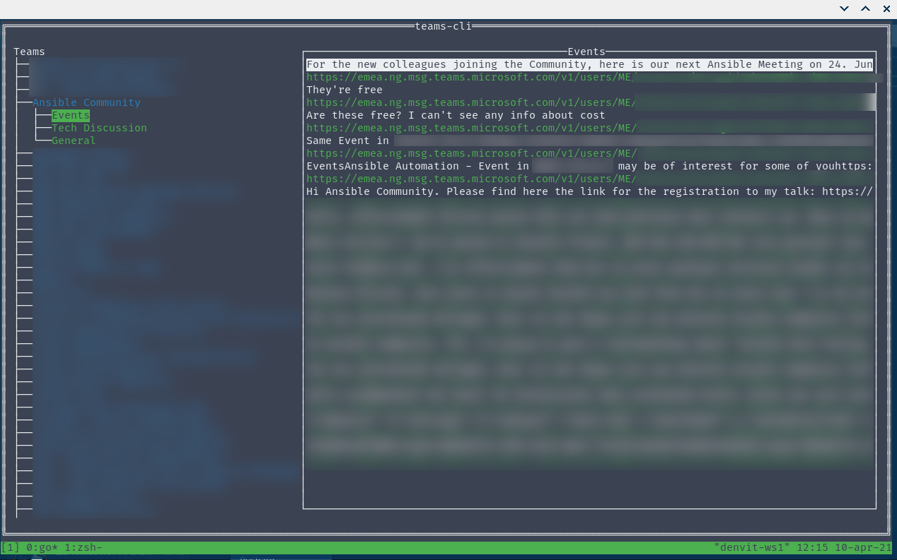

# teams-cli

A Command Line Interface (or TUI) to interact with Microsoft Teams

## Status

The CLI only let you log-in and fetches your user and conversations, but just displays the former.
This project is still WIP and will be updated soon with new features. The goal is to
have a CLI / TUI replacement for the Microsoft Teams desktop client.

## Requirements

- [Golang](https://golang.org/)

## Usage

Follow the instructions on how to obtain a token with [teams-token](https://github.com/fossteams/teams-token),
then simply run the following to start the app. Binary releases will appear on this repository as soon as
we have a product with more features.

```bash
go run ./
```

If everything goes well, you should see something like this:


## What works

- Logging in into Teams using the token generated via `teams-token`
- Getting the list of Teams + Channels
- Reading channels

## What doesn't work

- Names are not shown, instead a URL is displayed
- Everything else