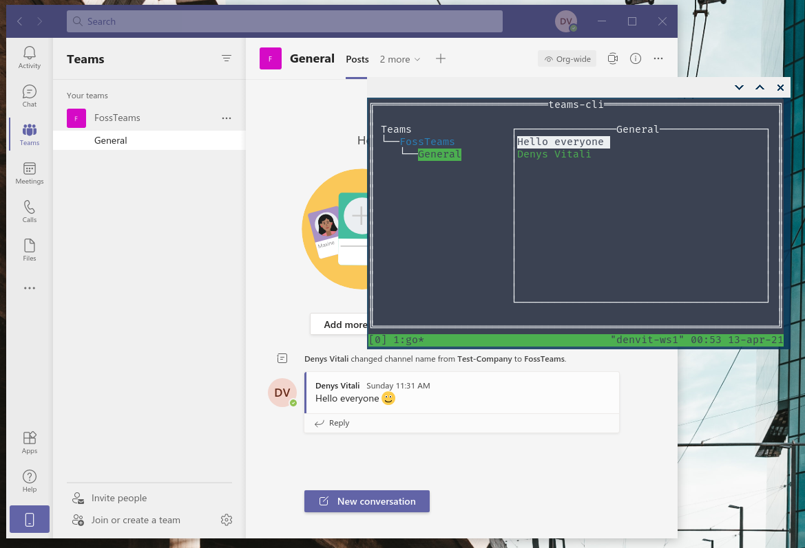

# teams-cli

A Command Line Interface (or TUI) to interact with Microsoft Teams
that uses the [teams-api](https://github.com/fossteams/teams-api)
Go package.

## Status

Upstream `fossteams/teams-cli` has been archived and is read-only. This fork is
the active maintenance branch for the codebase, and new work should target this
repository.

The CLI can authenticate with `teams-token`, list your Teams, Channels, and
Chats, and read recent messages inside the TUI.

This project is still WIP and will be updated with more features. The goal is to
have a CLI / TUI replacement for the Microsoft Teams desktop client.

Today the client is primarily read-only:

- Browse Teams, Channels, and direct/group Chats
- Read recent messages in the selected conversation
- Refresh conversations automatically without restarting the app
- Navigate the UI entirely from the keyboard

## Requirements

- [Golang](https://golang.org/)
- Valid Teams JWT files generated with [teams-token](https://github.com/fossteams/teams-token)
- A terminal with cursor-addressing support, for example Terminal.app or iTerm2

## Usage

Follow the instructions on how to obtain tokens with
[teams-token](https://github.com/fossteams/teams-token), then run the app.
Binary releases will appear on this repository as soon as we have a product
with more features.

```bash
go run ./
```

To limit each conversation view to the most recent `N` messages, pass either
`msg=<n>` or `--msg=<n>`:

```bash
go run ./ msg=20
go run ./ --msg=20
```

To build and run the local binary:

```bash
go build -o teams-cli .
TERM=xterm-256color ./teams-cli msg=20
```

The app reads your Teams JWT files from `~/.config/fossteams`. Keep those token
files outside this repository and do not commit them.

## Contributing

Contributions should be opened against this fork, not the archived upstream
repository.

- Open pull requests against this repository's `master` branch
- Run `go build ./...` and `go test ./...` before sending changes
- Keep local Teams JWT files outside the repository
- See [CONTRIBUTING.md](./CONTRIBUTING.md) for contributor setup and workflow

## Current Features

- Lists Teams, Channels, and Chats in one conversation tree
- Loads messages automatically when you move onto a channel or chat
- Limits the message view to the most recent `N` messages
- Shows a live loading indicator while messages are being fetched
- Refreshes the selected conversation every 5 seconds
- Refreshes the conversation tree every 15 seconds
- Keeps Teams, Channels, and Chats in a stable order while refreshing
- Displays a keyboard help overlay directly inside the TUI

## Runtime Behavior

When you select a leaf conversation, the message pane starts loading
immediately and shows a TUI loading bar until the fetch completes.

The selected conversation refreshes automatically every 5 seconds, and the
conversation tree refreshes every 15 seconds so new messages, renamed chats,
and ordering changes show up without restarting the TUI.

Chats and channels are sorted to make browsing more predictable:

- Teams prefer favorite and followed teams first
- Channels prefer pinned channels and `General`
- Chats prefer visible or sticky chats and then recent activity

## Token Safety

This repository should not contain your local Teams tokens.

- `teams-cli` reads tokens from `~/.config/fossteams`
- Local JWT artifacts are ignored by `.gitignore`
- Do not copy token files into this repository before building or testing

## Keyboard Navigation

The app is keyboard-first. A compact key legend is always shown at the bottom
of the screen, and `?` opens the full help view.

### Conversations Pane

- `Up` / `Down`: move between Teams, Channels, and Chats
- `Right` / `l`: expand a group, enter its first child, or open the selected conversation
- `Left` / `h`: collapse the current group or move to its parent
- `Esc`: go back one level
- `Enter`: open the selected channel or chat and move to the messages pane
- `Tab`: switch focus to the messages pane

### Messages Pane

- `Up` / `Down`: move through loaded messages
- `PgUp` / `PgDn`: page through messages
- `Home` / `End`: jump to the first or last loaded message
- `Left` / `h`: return to the conversations pane
- `Esc` / `Tab`: return to the conversations pane

### Global

- `?`: show or hide keyboard help
- `q`: quit
- `Ctrl+C`: force quit

If everything goes well, you should see something like this:


## What works

- Logging in to Teams using tokens generated via `teams-token`
- Getting the list of Teams, Channels, and Chats
- Reading recent messages in channels and chats
- Limiting message views to the most recent `N` messages via `msg=<n>` or `--msg=<n>`
- Showing live loading feedback while messages are being fetched
- Refreshing the selected conversation and conversation tree automatically
- Stable ordering for Teams, Channels, and Chats while refreshing
- Keyboard-first navigation between conversations and messages

## What doesn't work

- Sending messages
- Editing messages
- Reactions, uploads, calls, and the rest of the Teams feature surface

## You might also be interested in

- [fossteams-frontend](https://github.com/fossteams/fossteams-frontend): a Vue based frontend for Microsoft Teams
